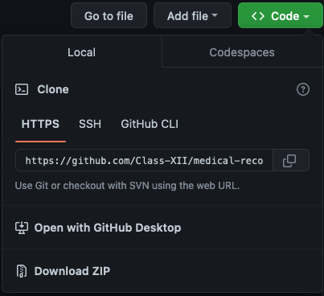
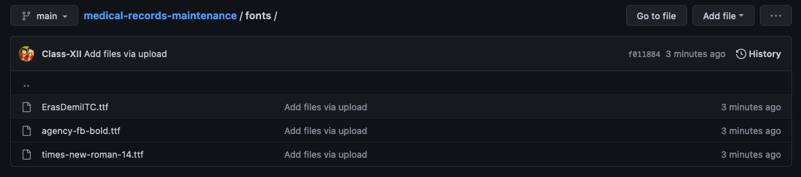

<div align="center">

  <h1> MEDICAL RECORD SYSYTEM MAINTAINANCE USING PYTHON AND TKINTER</h1>

  <sub>Done by: <a>Hanan fathima vattakkari,Jibin.C.Basil, Basil</a><br>
<small> January, 2022-23</small></sub>

</div>

# Introduction
- This program's objective is      maintenance of medical records using Python-tkinter and MySQL-Database Management.

- Additionaly, this program offers graphical user interfaces with option to save as .csv (Excel document) file.

## Features

- A six-letter pin to login onto the maintenance page.
- Add, view, edit, and delete records.
- Finding BMI of patients.
- Saving all records in csv file format.

## Requirements
To get along with the challenge you need to have the following:
- Python-3
- MySQL
- Internet
- Python Modules mentioned below
- A code editor (preferably Vs-Code)
- Custom Font (Optional,Mentioned below)

## NOTE

### Default setup
- Make sure you have mysql-connector-python installed and configured.
- The default username and password is set to 'admin'. To change password or the username, make changes in 
- Mysql user and passwd is 'root'and 'tiger' respectively, You might need to change in the main code

## Setup
- I believe you have the motivation, a computer and Internet and a dream. In addition to that basic to intermediate level knowledge in Python and its Modules. If you have those, then you have everything to get started.
or else i am afraid this is just too much for you my friend

### Install Python 3 (preferably 3.10)
Entire code runs on Python. Install [Python for windows](https://www.python.org/downloads/).

After downloading double click and install
We can check if node is installed on our local machine by opening our device terminal or command prompt.

```sh
admin $ python --version
Python 3.10.7
```
### Download git repository

- Download ZIP and extract 
  <div>OR<div>
### Clone git repository
Open git Bash.
Change the current working directory to the location where you want the cloned directory.
```sh
$ git clone https://github.com/Class-XII/medical-records-maintenance
>Cloning into 'medical-records-maintenance'...
>remote: Enumerating objects: 30, done.
>remote: Counting objects: 100% (30/30), done.
>remote: Compressing objects: 100% (29/29), done.
>remote: Total 30 (delta 11), reused 0 (delta 0), pack-reused 0
>Receiving objects: 100% (30/30), 20.26 KiB | 5.06 MiB/s, done.
>Resolving deltas: 100% (11/11), done.
```
### Install All Required Python 3 Modules.
modules
- tkinter
- mysql-connector
- csv

You can install modules using PIP

```
pip install MODULE-NAME
```
### Install Custom Fonts (Optional)

#### Fonts used
- Times new roman
- Eras demi ITC
- Agency FB bold

#### Installing fonts
- Open fonts folder in the repository.
- Install one by one.


## You can also run the main code in idle also 

### A Project Made By Students of 
- Class-XII 
- KENDRIYA VIDYALAYA KALPETTA
